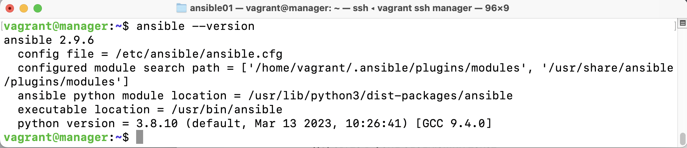
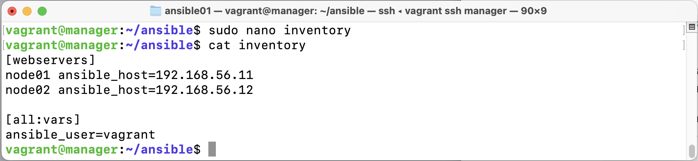

# REPORT_DevOps8_boltonth
# Инструменты автоматизации

## Contents

   1. [Удаленное конфигурирование узла через Ansible](#part-1-удаленное-конфигурирование-узла-через-ansible)
   2. [Service Discovery](#part-2-service-discovery)

## Part 1. Удаленное конфигурирование узла через Ansible

Удаленная настройка узла для разворачивания мультисервисного приложения.

**== Задание ==**

1) Создать с помощью Vagrant три машины - manager, node01, node02. Не устанавливать с помощью shell-скриптов docker при создании машин на Vagrant! Прокинуть порты node01 на локальную машину для доступа к пока еще не развернутому микросервисному приложению.

         создан src/ansible01/Vagrantfile

* Запущены три машины: 

2) Подготовить manager как рабочую станцию для удаленного конфигурирования (помощь по Ansible в материалах).
- Зайти на manager. 
 
- На manager проверить подключение к node01 через ssh по приватной сети. 
 

      Подключились к node01 (через vagrant ssh node01).
      Убедились, что SSH-сервер запущен:
         sudo systemctl status ssh
      Открыли для редактирования: 
         sudo nano /etc/ssh/sshd_config
      Убедились, что параметры настроены правильно:
         PasswordAuthentication yes
      Перезапустили SSH-сервер:
         sudo systemctl restart ssh

- Сгенерировать ssh-ключ для подключения к node01 из manager (без passphrase). 
* Генерация ключа командой:  
`ssh-keygen -t rsa -b 2048 -N "" -f ~/.ssh/id_rsa` 
 
* Подтверждение инсталляции ключа  node01: 
 
* Демонстрация ключа на node01: 
 

- Скопировать на manager docker-compose файл и исходный код микросервисов. (Используй проект из папки src и docker-compose файл из предыдущей главы. Помощь по ssh в материалах.)
* Перенос исходного кода микросервисов: 

* Перенос файла docker-compose.yml: 

* Проверка успешности переноса на машине manager: 
 

- Установить Ansible на менеджер и создать папку ansible, в которой создать inventory-файл. 

      sudo apt update
      sudo apt install -y ansible
* Результат установки: 
 

* Создание inventory файла: 
 

- Использовать модуль ping для проверки подключения через Ansible. 
- Результат выполнения модуля поместить в отчет.
* Выполнение модуля ping: 
 

3) Написать первый плейбук для Ansible, который выполняет apt update, устанавливает docker, docker-compose, копирует compose-файл из manager'а и разворачивает микросервисное приложение. 

         Создан src/ansible01/main.yml, размещен на manager /home/vagrant/ansible/main.yml
* Результат запуска написанного плейбука командой ansible-playbook -i inventory main.yml: 
 
 

4) Прогнать заготовленные тесты через postman и удостовериться, что все они проходят успешно. В отчете отобразить результаты тестирования. 

* проверка проброса портов с локальной машины на node01 
 
* проверка выполнения запроса из командной строки  
 
* результат запуска тестов в Postman 
 

5) Сформировать три роли: 
 - роль application выполняет развертывание микросервисного приложения при помощи docker-compose,
 - apache устанавливает и запускает стандартный apache сервер
 - postgres устанавливает и запускает postgres, создает базу данных с произвольной таблицей и добавляет в нее три произвольные записи. 

         Выполнена инициализация ролей:
         cd ~/ansible    
         ansible-galaxy init roles/application   
         ansible-galaxy init roles/apache    
         ansible-galaxy init roles/postgres  

* результат инициализации  
 
 

 - Назначить первую роль node01 и вторые две роли node02, проверить postman-тестами работоспособность микросервисного приложения, удостовериться в доступности postgres и apache-сервера. Для Apache веб-страница должна открыться в браузере. Что касается PostgreSQL, необходимо подключиться с локальной машины и отобразить содержимое ранее созданной таблицы с данными. 

         Расписаны задачи для каждой роли:
         src/ansible01/roles/apache/tasks/main.yml
         src/ansible01/roles/application/tasks/main.yml
         src/ansible01/roles/postgres/tasks/main.yml 
         
         Создан плейбук для применения ролей src/ansible01/roles.yml
         размещен на manager /home/vagrant/ansible/roles.yml

* внесены изменения в ansible.cfg 
 
* результат запуска playbook.yml 
 

* результат запуска тестов в Postman 
 

* страница Apache в браузере 
 

- Подключимся к базе данных из консоли node02: 
      
      sudo -u postgres psql -d devops8_db 
      SELECT * FROM arbitrary_table 

* результат проверки внесения записей в таблицу postgres 
 

 - Пробросим порт (модифицируем Vagrantfile и сделаем reload node02) на локальную машину и подключимся к базе данных через pgAdmin c локальной машины  

         добавим разрешение в: 
         /etc/postgresql/12/main/pg_hba.conf  

* результат проверки внесения записей в таблицу postgres при подклчении с локальной машины
 

6) Созданные в этом разделе файлы размещены в папке `src\ansible01` в личном репозитории.

## Part 2. Service Discovery

Теперь перейдем к обнаружению сервисов. В этой главе тебе предстоит cымитировать два удаленных сервиса - api и БД, и осуществить между ними подключение через Service Discovery с использованием Consul.

**== Задание ==**

1) Написать два конфигурационный файла для consul (информация по consul в материалах):
- consul_server.hcl:
   - настроить агент как сервер;
   - указать в advertise_addr интерфейс, направленный во внутреннюю сеть Vagrant  

* содержимое consul_server.hcl  
 

- consul_client.hcl:
   - настроить агент как клиент;
   - указать в advertise_addr интерфейс, направленный во внутреннюю сеть Vagrant  

* содержимое consul_client.hcl  
  

2) Создать с помощью Vagrant четыре машины - consul_server, api, manager и db. 
- Прокинуть порт 8082 с api на локальную машину для доступа к пока еще не развернутому api
- Прокинуть порт 8500 с manager для доступа к ui consul.  

      Создан src/ansible02/Vagrantfile   

3) Написать плейбук для ansible и четыре роли:   

         Создан src/ansible02/main.yml 
         размещен на manager /home/vagrant/ansible/main.yml  
* Выполнение модуля ping:      
  
* создание ролей    
  

- install_consul_server, которая:
   - работает с consul_server;
   - копирует consul_server.hcl;
   - устанавливает consul и необходимые для consul зависимости;
   - запускает сервис consul   

         Создан src/ansible02/install_consul_server/tasks/main.yml   

* результат запуска consul_server    
  
  
  

- install_consul_client, которая:
   - работает с api и db;
   - копирует consul_client.hcl;
   - устанавливает consul, envoy и необходимые для consul зависимости; 
   - запускает сервис consul и consul-envoy;   

         Создан src/ansible02/install_consul_client/tasks/main.yml   

* результат запуска consul и envoy    
  
  
  
  
  
  
  
  
  
  
  
  
  

- install_db, которая:
   - работает с db;
   - устанавливает postgres и запускает его;
   - создает базу данных `hotels_db`;   

         Создан src/ansible02/install_db/tasks/main.yml   
* результат создания базы данных `hotels_db`    
  

- install_hotels_service, которая:
   - работает с api;
   - копирует исходный код сервиса
   - устанавлвиает `openjdk-8-jdk`
   - создает глобальные переменные окружения:
      - POSTGRES_HOST="127.0.0.1"
      - POSTGRES_PORT="5432"
      - POSTGRES_DB="hotels_db"
      - POSTGRES_USER="<имя пользователя>"
      - POSTGRES_PASSWORD="<пароль пользователя>"
   - запускает собранный jar-файл командой `java -jar <путь до hotel-service>/hotel-service/target/<имя jar-файла>.jar`   

         Создан src/ansible02/install_hotels_service/tasks/main.yml   

* установленные переменные   
  
* результат запуска hotel-service   
  
  
  
  

4) Проверить работоспособность CRUD-операций над сервисом отелей. В отчете отобразить результаты тестирования.

* GET-запрос (информация обо всех отелях) к подключенной базе с использованием postman с локальной машины   
  

* POST-запрос добавление нового отеля   
  

* GET-запрос проверка выполненного добавления   
  

* GET-запрос получение опреденного количества объектов (с использованием пагинации)   
  

* таблица в базе после манипуляций   
  
* search запрос из браузера   
   

5) Созданные в этом разделе файлы размещены в папках `src\ansible02` и `src\consul01` в личном репозитории.
